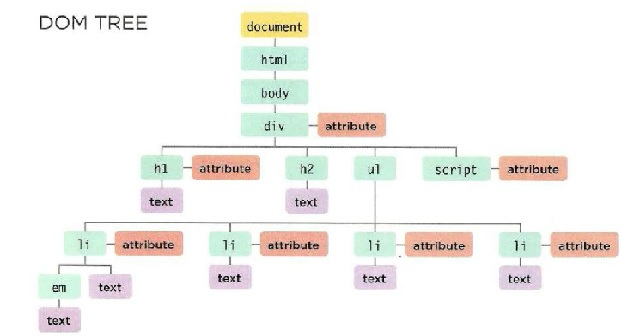

# Class 06 Reading Notes.

[HOME](https://sayefdeen.github.io/reading-notes201/)

---

## Chapter 3 Js Book, Objects.

Objects group together a set of variables and function to create a model of a something you would recognize from the real world,

<p style = "text-transform : Uppercase"> in an objects variables becomes known as properties </p> properties tell us about the object,such as the name of a hotel or the number of rooms it has.
<p style = "text-transform : Uppercase"> in an objects functions becomes known as methods </p> methods represent tasks that are associated with the object.

**Example**:

```javascript
var hotel = {
  name: "Quay",
  rooms: 40,
  booked: 25,
  gym: true,
  roomTypes: ["twin", "double", "suite"],
  checkAvailability: function () {
    return this.rooms - this.booked;
  },
};
// This is How to accessing an object, properities and methods.
var hotelName = hotel.name;
// This will gives us hotelName = Quay;
var roomesFree = hotel.checkAvalibilty();
// This will execute the function inside the object hotel.
// Another way to access an Object (JUST ITS PROPERTIES).
var hotelRooms = hotel["rooms"];
```

The code above, you can see name,rooms,booked,gtm, and roomTypes : all of htese are called properties which have KEY and VALUE fro each one.
checkAvailability(); called a method.

<p> You accessing an Object by using what we call a <b>DOT NOTATION</b> It is shown above in the comments.</p>

---

## Chapter 6 Js Book Document Object Model.

The Document object model (DOM) specifies how browsers shuould create a model of an HTML page and how JavaScript can access and update the contents of a web page while it is in the browser window.

You can imagin that the HTML page is like a tree, each element has some branches under it all these branched has one parent in the top of it. which it is the `<html>` tag .

```html
<html>
  <body>
    <div id="page">
      <h1 id="header">List</h1>
      <h2>By groceries</h2>
      <ul>
        <li id="one" class="hot"><em>fresh</em></li>
        <li id="two" class="hot">pinenuts</li>
        <li id="three" class="hot">honey</li>
        <li id="four">balsamic vinegar</li>
      </ul>
      <script src="js/list.js"></script>
    </div>
  </body>
</html>
```



<p><span style="color:yellow">The Document Node</span> it represent the entire page (and also correspondes to the document object.), when you access ant element, attribute, or text node you navigate to it via the document node, relationships between the document and all of the element nodes are descibed using the terms as a family tree : Parent,Children,Sibling, Ancestors, and Descendants.
<p><span style="color:green">The Element Nodes</span> HTML elements describe the structure of an HTML page, to access the DOM tree, you should start by looking for elements, then you can access its text and attribute nodes if you want to.
<p><span style="color:orange">The Attribute Nodes</span> Attribute nodes are not <b>children</b> of the element. 
<p><span style="color:pink">Text Nodes</span> Once you have accessed an element node, you can then reach the text within that element

### Working with the DOM tree.

<br>

1.  Access the elements : you can access any element in the DOM by using these selectors.

    - getElementById(id name) : Used to select an element with a specific id.

    - getElementsByClassName(class name) : Used to select all elements that have that class name as an attribute (Returns an array of elements), to select one of the items you can use the **item(index)** method or you can access it just like an array.

    - parentNode: select the parent of the current element node.

    - previousSibling/nextSibling: select the previous of next sibling of the DOM tree.

    - firstChild/lastChild: select the first child of the last of the current element.

    - querySelector(): Uses a CSS selector, and returns the first matching element.

    - getElementsByTagName(tag name) : select all elements that have this tag name.

    - querySelectorAll(): Uses a CSS selector to select all matching elements.

2.  Work with those elements.

- Access/Update Text nodes:

  - nodeValue :This property lets you access or update contents of a text node.

- Work with HTML content

  - innerHTMl : allows to access child elements and text content.

  - textContent : same as innerHTML.

  - createElement()/createTextNode() : this method let you create new nodes.

  - appendChild()/removeChild() : Add nodes to a tree/ remove nodes from a tree.

- Access or Update Attribute values

  - hasAttribute() : checks if the attribute exists.

  - getAttribute() : get the value of an attribute.

  - setAttribute() : update the value.

  - removeAttribute() : removes the attributes.

### Cross-site Scripting (XSS) attacks.

if you add HTML to a page using inerHTML (or several jQuery methods), you need to be aware of Cross-Site-Scripting Attacks or XSS, other wise an attacker could gain access to your users' accounts.

<h4> How XSS Happens</h4>

XSS involves an attacker placing malicious code into a site, websites ofter feature content created by many different people, Data you do not have complete control over is known as **untrusted data**; it must be handled with care.

<h4 style="text-transform: capitalize"> what can hese attacks do</h4>

XSS can gice the attacker access to informtion in :

- The DOM (including form data).
- That website's cookies.
- Session tokens: information that identifies you from other users when you log into a site

<h4 style="text-transform: uppercase">Defending against cross-site scripting</h4>

Validate inpute going to the server.

1. Only let the visitors input the kind of characters they need to when supplying information, This is known as **Validation**.

2. Double-check calidation on the server before displaying user content/storing it in a database, users can bypass validation in the browser by turning JavaScript off.

3. The database my saftly contain markup and script from trusted sources, This is because it does not try to process the code; it just stores it.

4. As the data leaves the database, all potentailly dangerous characters should be escaped.

5. Make sure that you are only inserting content generated by users into certain parts of the template files.

6. Do not create DOM fragments containing HTML from untrusted sources. It should only be added as text once it has been escaped.
