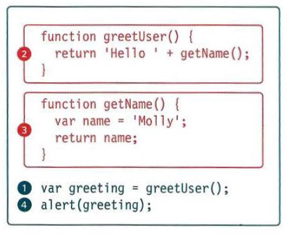

# Class 10 Reading Notes.

[HOME](https://sayefdeen.github.io/reading-notes201/)

## Chapter 10 JS Book Error Handling & Debugging.

Programming is like problem solving, don't expect ro write it perfectly at the first time, so we are going to learn how ti find the errors in your code.

### Order Of Execution.



<p>This script create a greeting massege, you might think the order of execution would be as numberd, but it is a little more complicated </p>

<p>To Complete stepp one, the interpreter needs the results of the funstion in steps 2 and 3, because the message contains calues returned by those functions the order of execution is more like this : 
<span style="color:red;">1,2,3,2,1,4</span></p>

- Step(1) The greeting varaible gets value from the greetUser() function.

- Step(2) greetUser() creates the message by combining the string 'Hello ' with the result of getName().

- Step(3) getName() returns the name of greetUser().

- greetUser() now knows the name, and combines it with the string. It then returns the ,essage to the statment that called it in Step(1).

- 1. The value of the greeting is stored in memory.
- 4. This greeting variable is written to an alert box.

The JavaScript interpreter uses the concept of **execution contexts** There is one global execution context; plus each function creates a new execution context. They correspond to variable scope.

<ul>
<li>GLOBAL CONTEXT : Code that is in the script, but not in a function There is only one global context in any page</li>
<li>FUNCTION CONTEXT : Code that is being run wihtin a function. Each function has its own function context.</li>
</ul>

### The Stack.

The javaScript interpreter procsses one line of code at a time, when a statment needs data from another function, it stacks (or piles) the new function on top of the current task.

Lets take a look at out example above:

1.  The value for the greeting variable is obtained by calling the greetUser() function, so the variable cannot be addigned until the greetUser() function has done its job.

2.  The previous statment is effectivly put on hold, and the greetUser() task gets stacked on top of it, in turn the greetUser() function cannot return a value until the getName() function has completed its task.

3.  So, getName() is stacked on top of the greetUser() function, You can see the stack is starting to build up. When getName() has done its job, a vaue is returned back to the greetUser() function.

4.  Since getName() has done its job, it is removes from the stack. In turn, the greetUser() function can now finish its job and return a value to the greeting vairable.

5.  The greetUser() function has finished its work and it is removed from the stack and the value is finally assigned to the greeting variable.

### Execution Context & Hoisting.

Each Time a script enters a new execution context, there are two pahese of activity:

1.  Prepare
    - The new scope is created.
    - Variables, functions,and arguments are created
    - The value of the _this_ keyword is determind.
2.  Execution
    - Now it can assing value to variables.
    - Reference function and run their code.
    - Execute statment.

Understanding these two phases happend helps with understanding a concept called _hoisting_, You may have seen that you can :

- Call functions _before_ they have been declared(if they were declared using function decleration, not function expressions).
- Assign a value to a variable that has not yet been declared.

```javascript
//  Try this at your Console.
function helloWorld() {
  greeting = "hello World!!";
  return greeting;
}
console.log(helloWorld());
```

This is because any variables and function within each execution context are created before they are executed, The preparation phase if often described as taking all of the variablres and function and hoisting them to the top of the execution context, Or you can think of them as having been _prepared_.

### UnderStanding Errors.

If a JavaScript statment generates an error, then it throws an exception. At that point, the interpreter stops and looks for exception-hadling code.

Error Objects can help you find where you mistakes are and browsers have tools to help you read them.

When an Error Object is created, it will contain the following properties:

- Name : Type of execution.
- Message : Description.
- fileNumber : Name of the JavaScript file
- lineNumber : Line number of error.

There are seven types of built-in error objects in JavaScript.

- **Error** : Generic Error - the other error are all based upon this error.

- **SyntaxError** : Syntax has not been followed.

- **ReferenceError** : Tried to reference a variable that is not declared/within scope.

- **TypeError** : Am unexpection data type that cannot be coreced.

- **RangeError** : Numbers not in acceptable range.

- **URIError** : encodeURI(), decodeURI(), and similar methods used incorrectly.

- **EvalError** : eval() function user incorrectly.

Now that you know what an error is and how the browser treats them, there are two things you can do with the errors.

1.  Debug the script to fix errors:

If you come across an error while writing a script, you will need to debug the code, track down the sources of the error, and fix it.
by using the `debugger` keyword before the line you want to start your debuging from it.

2.  Handle Errors Gracefully:

You can handle errors gracefully using try,catch,throw,and finally statments. Sometimes and error may occure in the script for a reason beyond your control

```javascript
try {
  // Try to execute this code
} catch (exception) {
  // If there is an exception, run this code.
} finally {
  // This is always gets executed.
}
```

- try : First you specify the code you think might throw an exception within the try block.
- catch : ifthe try code block throws an exceptionm catch steps in with an alternative set of cod, it has one parameter: the error object, Although it is optional.
- finally : the contents of the finally code block will run either way- whether the try block successded of failed.

3.  You can use`concole.log()/console.table()` to track your activity and see what data your are dealing with.
